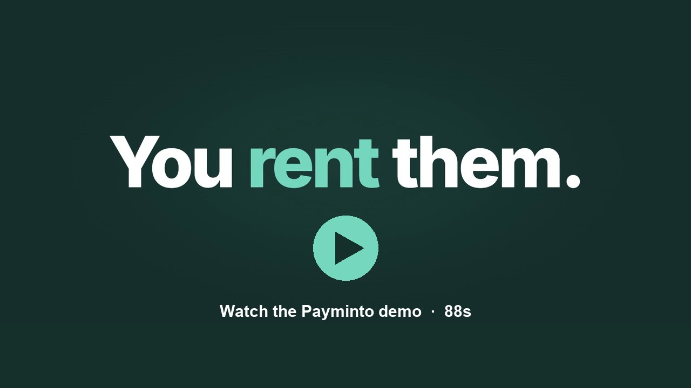

# Hackathon demo: open-source gateway with Chainlink CRE solvency attestation

Everything below runs locally. Nothing is deployed to a public network. Screens marked "Sample data" are dev previews of the real pages.

## Demo video

**Check demo here:** [watch the Payminto demo in your browser (88s)](https://drive.google.com/file/d/16598TrZ1iaGPIQKRVm_gZ0wkX82eXABI/view)

[](https://drive.google.com/file/d/16598TrZ1iaGPIQKRVm_gZ0wkX82eXABI/view)

It covers the problem, who it is for, the market, the product, why multichain and composable, why Solana, Chainlink CRE and NOWNodes verification, and traction.
Full-quality 1080p download: [payminto-demo.mp4](https://github.com/payminto-io/app/releases/download/demo-video/payminto-demo.mp4) from the [demo-video release](https://github.com/payminto-io/app/releases/tag/demo-video).
All hackathon material (video and pitch deck): [Google Drive folder](https://drive.google.com/drive/folders/1LC3jWfza6qiMsV1Xc-qfu8zydhRSwOJk).

## Pitch deck

Check the pitch deck here: [Payminto pitch deck (Google Drive)](https://drive.google.com/file/d/1S9ZHGs2dDlsVGEZDbhm7Yf9ZtG1Gy-TT/view).
It covers the product, the AWS reference deployment, the NOWNodes, Chainlink CRE, and Solana settlement flow, and screenshots of the running product.

## The story (60 seconds)

An open-source, self-hostable payment gateway where fiat and stablecoins are peer rails and every number is a double-entry ledger line.
The unique part: an optional Chainlink CRE workflow proves the gateway is solvent. It compares what the ledger owes merchants with what custody actually holds on chain, and writes a signed report on chain that anyone can verify. Chainlink Proof of Reserve attests assets; this also attests liabilities.

## Click path

1. Dashboard home and payments (design system, test/live switch): http://localhost:3022/design/preview
2. Payment link builder, six steps with live checkout preview (fees from the server, never the browser): http://localhost:3022/design/preview/links/new
3. Links list with short links and QR: http://localhost:3022/design/preview/links
4. Hosted checkout, every stablecoin state (address, QR, countdown, confirming, under/over paid, paid): http://localhost:3021/preview
5. CRE settings in the dashboard (on/off at install, provider, last attestation): http://localhost:3020/design/preview/settings/attestations
6. The live attestation, verified by the gateway from its own RPC against the on-chain event:
   http://localhost:8097/api/v1/public/attestations/e78d154f-51e8-40a1-9227-334192e68b18
   Shows: liabilities 1,250 USDC, reserves 1,300 USDC, status attested, provider chainlink, tx and block on the local chain, consumer and forwarder contracts.

## Run it again live (optional, about 1 minute)

```bash
cd cre
~/.cre/bin/cre workflow simulate workflows/solvency --target local-simulation --non-interactive --trigger-index 0
```
Prints the labelled result (liabilities vs reserves) without writing. The broadcast path is in `cre/README.md` ("Without Chainlink access").

## What is real, what is next

- Built and tested on main: double-entry ledger, versioned fee rules, live/test isolation, payment switch (intents, attempts, idempotency, reconciler), payment links with server-side preview, CRE consumer contract (audited, 81 tests, real Keystone forwarder path).
- Built on branches, in review: custody (self-custody fence against double payment), Solana USDC/USDT, routing across rails, Kuberpays and Payvang demo connectors, CRE module verifier.
- Next: BitGo custody with Solana, NOWNodes RPC, settlement policy, deposit-finality attestation gating settlement.
- Going to production with CRE needs Chainlink early access: deploy, bind the real workflow id, Vault DON secrets. Steps in `cre/README.md`.
