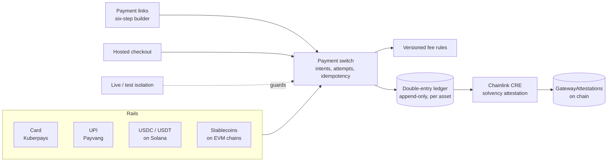

# Payminto

An open-source, self-hostable payment gateway that connects multiple payment providers and stablecoins as peer rails on one double-entry ledger, with an optional Chainlink CRE workflow that proves the gateway is solvent.


## Hackathon tracks

| Track | Read this | What we built |
| --- | --- | --- |
| **Chainlink** | [tracks/chainlink/README.md](tracks/chainlink/README.md) | A CRE workflow that attests a gateway's liabilities against on-chain reserves; audited consumer contract; gateway-side verifier; proven end to end on a local chain |
| **Solana** | [tracks/solana/README.md](tracks/solana/README.md) | USDC and USDT accepted on Solana beside the connected payment providers, one ledger, crash-safe sweeps |
| **NOWNodes** | [tracks/nownodes/README.md](tracks/nownodes/README.md) | RPC for Solana and the EVM chains, treated as evidence: two distinct providers for every money decision |
| **AWS** | [tracks/aws/README.md](tracks/aws/README.md) | How the gateway runs on AWS with isolated keys and environments (deployment design) |

Demo script: [DEMO.md](DEMO.md).

## The problem

Merchants who want to accept stablecoins next to cards today choose between closed, custodial processors and open-source tools that cover one rail.
Stripe (via Bridge), Shift4, BitPay and BVNK do fiat plus crypto, all closed and custodial.
Hyperswitch, the open-source orchestrator at scale (45.3k stars), has two crypto connectors, and one of them shut on 2026-03-31.
Genuine stablecoin payments were about $390B in the year to September 2025, $226B of it business to business, growing 733% year on year ([a16z](https://a16zcrypto.com/posts/article/state-of-crypto-report-2025/)); Visa, Mastercard and Stripe settle stablecoins on Solana.

And a merchant who lets a gateway hold money has to trust its balance sheet; Proof of Reserve shows what is held, not what is owed.

## What Payminto does



- **One ledger for every rail.** A card payment and a USDC payment land as the same double-entry lines; balances are derived, never stored; history cannot be rewritten by the application role.
- **Fees you can audit.** Versioned fee rules, never edited in place; every payment records the rule version it paid.
- **A payment switch.** Intents and attempts, connector-evidence-first state machine, exclusive claims so a capture can never be sent twice, a reconciler that resolves unknown outcomes from the provider.
- **Payment links.** A six-step builder with a live checkout preview built by the server, unguessable short links and QR codes.
- **Solana stablecoins.** USDC and USDT as separate assets, wrong tokens never credited, sweeps that survive crashes and racing workers.
- **Chainlink CRE, optional.** Off by default; when on, a workflow attests liabilities against reserves on chain and the gateway re-verifies every report from its own RPC.
- **Live and test isolation.** One environment per process, refusals at boot for development keys, mock providers, test databases and testnets in live.

## Status

| Built and in `main` | On branches, not merged |
| --- | --- |
| Ledger, fee rules, live/test isolation, payment switch, payment links and builder, hosted checkout UI, Solana USDC/USDT, Chainlink CRE contract, module and solvency workflow, design system and dashboard | Custody providers (self-custody fence, BitGo next), Kuberpays and Payvang connectors, routing across rails, links on the switch with every method, NOWNodes RPC preset, one-command compose and CI |

Every merged module went through independent review rounds; the review findings and fixes are in the commit history.

## Run it

Install each Node workspace once, then run these commands in separate terminals:

```sh
make backend   # API: http://localhost:8090
make frontend  # dashboard: http://localhost:3003
make checkout  # hosted checkout: http://localhost:3002
make landing   # marketing site: http://localhost:3001
```

The backend target loads `backend/.env`; Go does not load that file by itself.
After the services are ready, verify health, CORS, admin/merchant sign-in, and the core authenticated APIs with:

```sh
make smoke-local
```

Tests:

```sh
cd backend && go test ./...
make test-integration          # Postgres testcontainers
cd contracts && forge test     # contracts, including the CRE consumer
cd cre && bun test             # CRE workflow
```

## Repository map

| Path | What |
| --- | --- |
| `backend/` | Go API and workers: ledger, fees, environment, payment switch, connectors, links, Solana, CRE |
| `frontend/` | Merchant dashboard (Next.js) |
| `checkout/` | Hosted checkout (Next.js) |
| `contracts/` | Foundry contracts: sweep contracts and the CRE consumer `GatewayAttestations` |
| `cre/` | Chainlink CRE project and the solvency workflow |
| `docs/` | Architecture, operations, CRE research and spec, design system |
| `tracks/` | Hackathon track write-ups |
| `.scratch/payments-v1/` | Specification, plan and tickets |

## License

MIT
