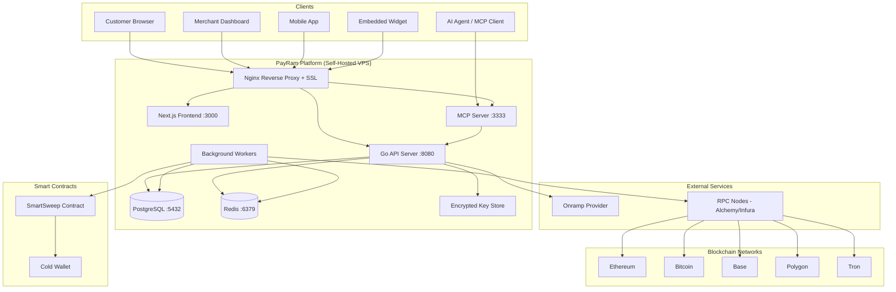
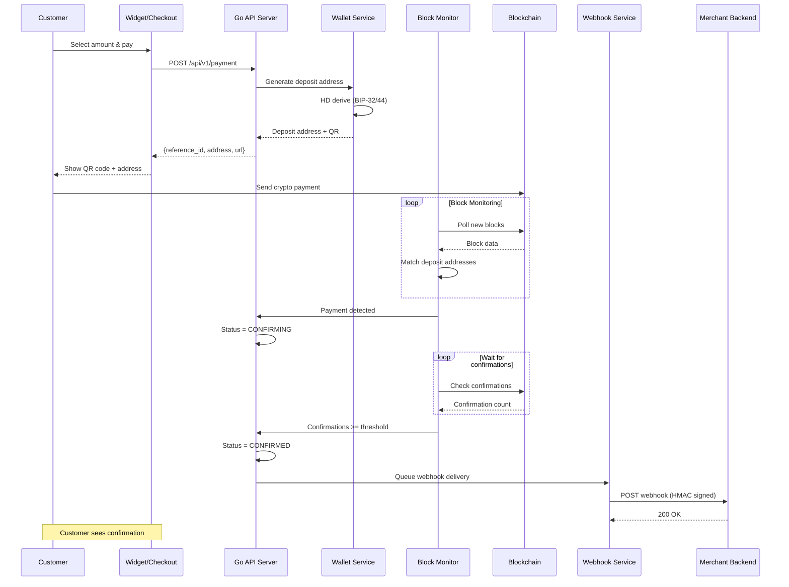
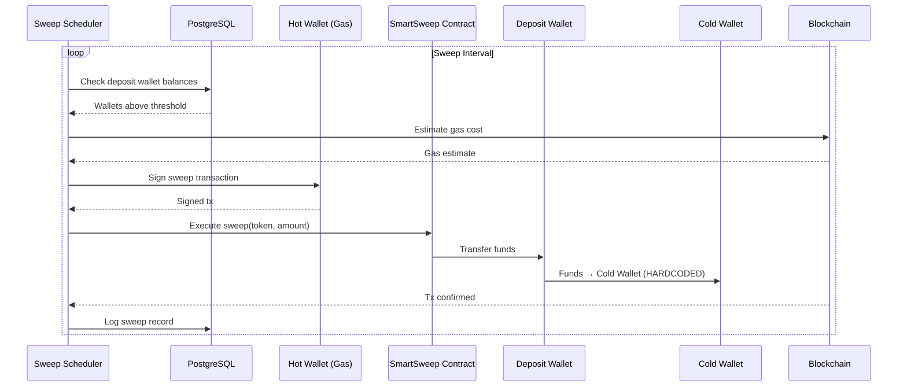
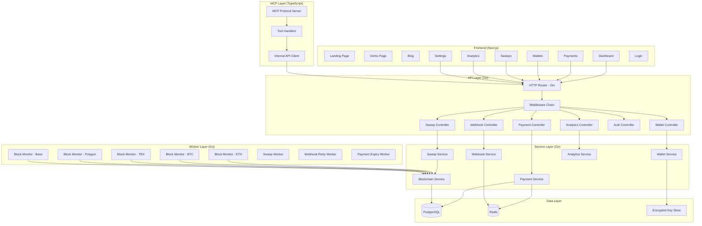
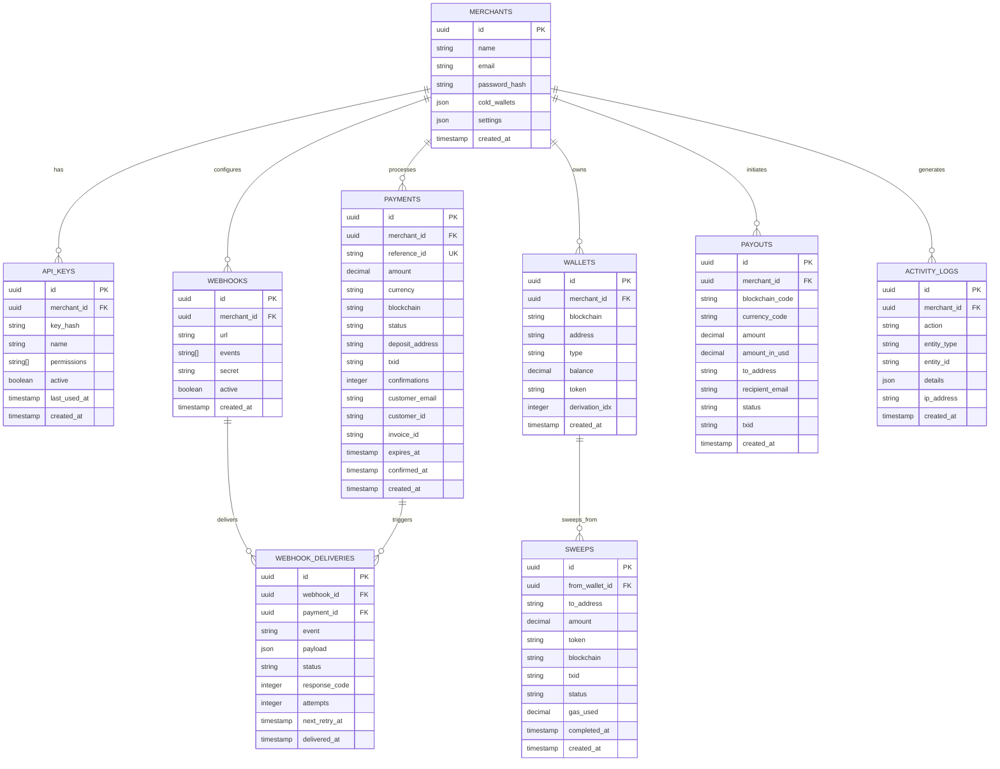
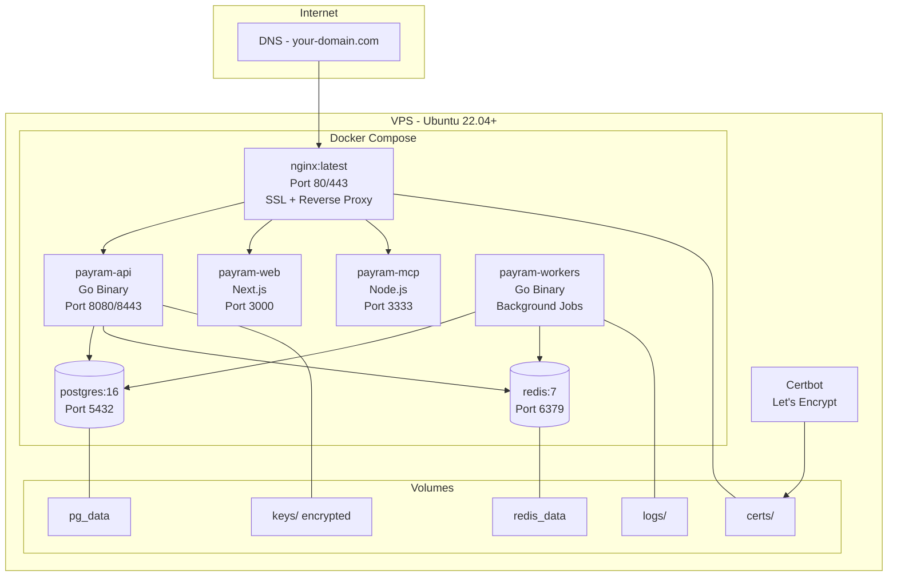
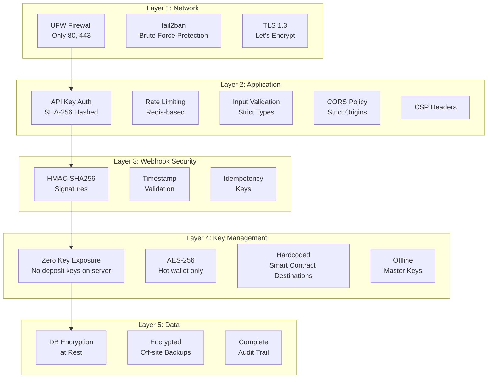
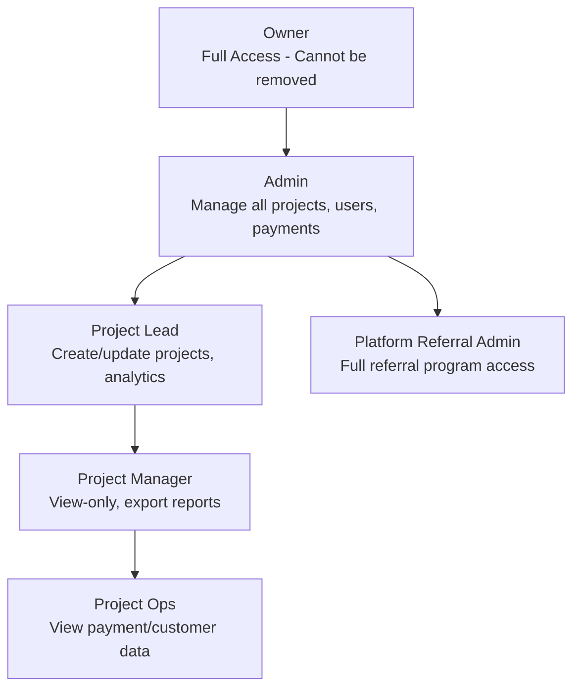
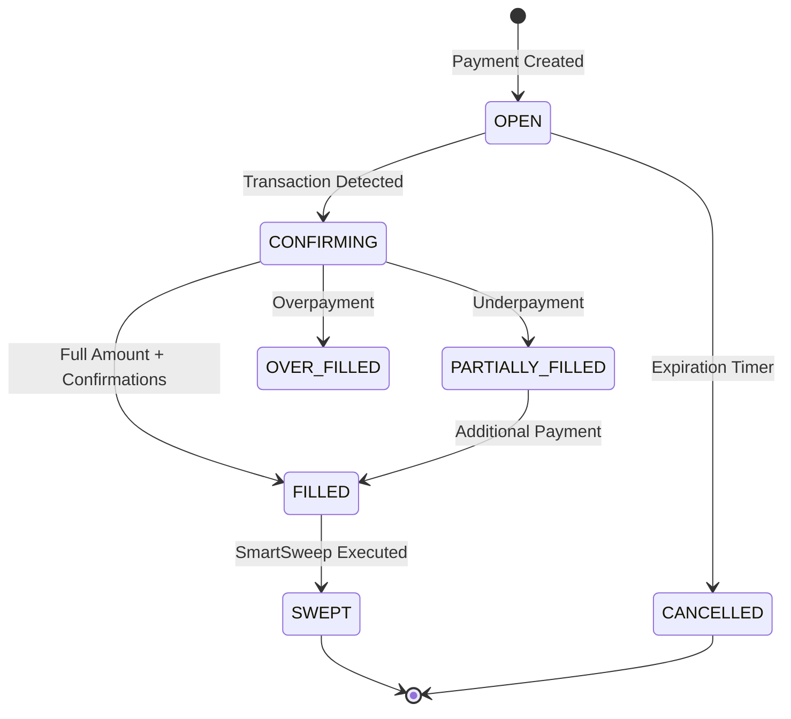
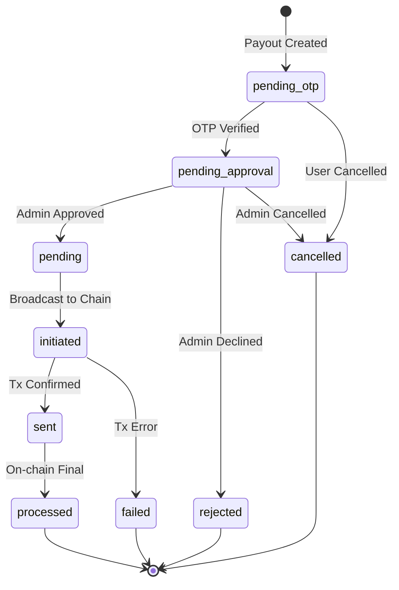

# PayRam Clone - Mermaid Diagrams

**Purpose:** Machine-renderable diagrams for documentation and planning

---

## 1. System Context Diagram

---

## 2. Payment Flow

---

## 3. SmartSweep Flow

---

## 4. Component Architecture

---

## 5. Database ERD

---

## 6. Deployment Architecture

---

## 7. Security Layers

---

## 8. User Role Hierarchy

---

## 9. Payment Status State Machine

---

## 10. Payout Status State Machine

