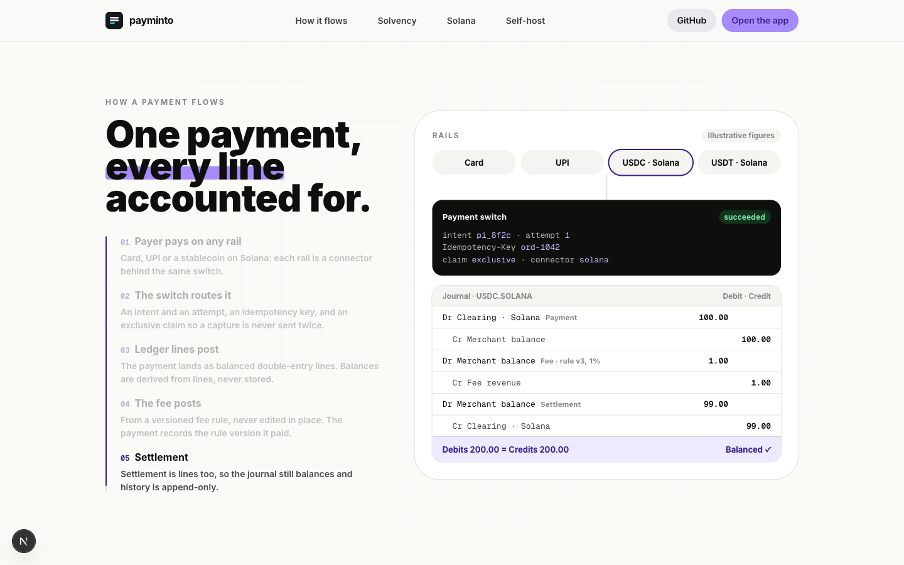
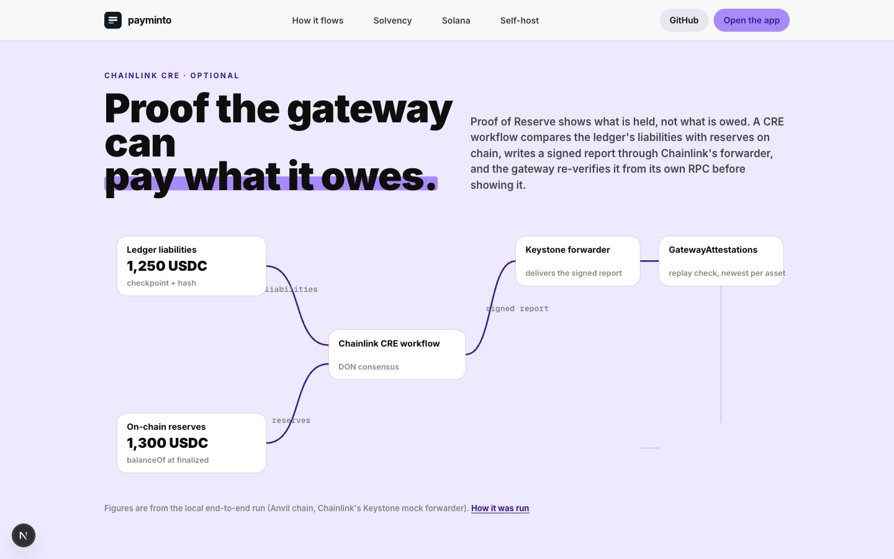
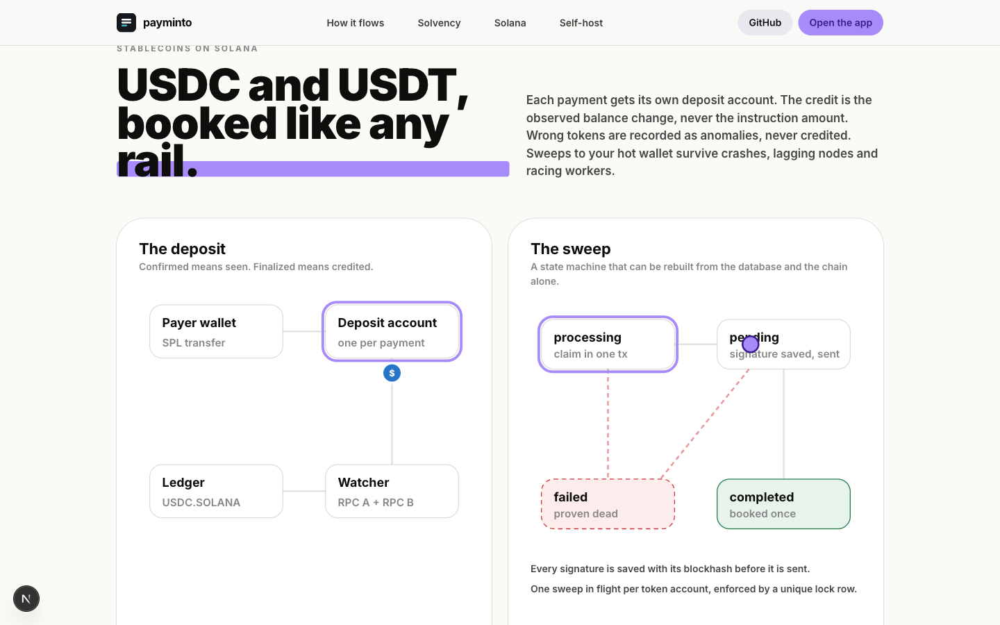

# Motion on the landing page

Research notes, the rules we took from them, and what the page does with them.

## What we studied

### Stripe

- The Stripe front-end team animates only `transform` and `opacity`, uses `will-change` to promote the few layers that move, and keeps most interaction animations under 500 ms with custom cubic-bezier curves rather than the browser defaults.
  Source: [Connect: behind the front-end experience](https://stripe.com/blog/connect-front-end-experience).
- The same post describes `prefers-reduced-motion` handled in both CSS and JavaScript, so decorative motion stops while state changes stay visible.
- [stripe.com/payments](https://stripe.com/payments) tells the product story with real UI fragments (checkout, payment method selectors, dashboard cards) rather than abstract illustrations.
  The "modular solutions" section ([Mobbin](https://mobbin.com/sites/sections/68111fb0-8a8b-4558-8076-0ab17e17f44a)) draws one line between two product tiles to show they connect: a single line carries the idea.
- Depth comes from layered 3D transforms (`perspective`, `translateZ`), not from blur or shadows that repaint.

### Mercury

- The "layers" section ([Mobbin](https://mobbin.com/sites/sections/3a483a4e-ab5c-494e-9db9-c6d41660be22)) explains infrastructure as stacked planes with a label per layer: the stack is the explanation.
- The "Figure A" diagram ([Mobbin](https://mobbin.com/sites/sections/16c55a93-735f-47d3-9b05-8fae754b1cac)) uses thin strokes and numbered nodes, which suits draw-on line reveals.

### Linear

- The hero ([Mobbin](https://mobbin.com/sites/sections/b3626c90-279d-4b7c-9de0-06309c5002cc)) is one product card, one headline, one orchestrated entrance; nothing else moves.
  The restraint is the pattern: one moment per section, not effects everywhere.

### Midday, Base, Lassie (pinned and stepped stories)

- Midday "How it works" ([Mobbin](https://mobbin.com/sites/sections/feaf92f2-1f1e-45bc-b9a0-39b2102c816e)): a step list on the left with the active step bold, and a ledger-like table on the right that fills in as you advance.
  This is the closest match to a payment flowing into a ledger.
- Base "How it works" ([Mobbin](https://mobbin.com/sites/sections/708024f4-b3ae-434c-8e35-3d7c0bab432e)): deposit, private ledger, withdraw, drawn as a flat node diagram with pill labels.
- Lassie ([Mobbin](https://mobbin.com/sites/sections/310955c5-6f5c-44eb-bb3c-ca0362b77008)): three steps, each built from real UI cards joined by a labelled connector.

### Performance and accessibility references

- Chrome's [scroll animation performance case study](https://developer.chrome.com/blog/scroll-animation-performance-case-study): scroll runs on its own thread, main-thread scroll handlers jank under load, compositor-only properties do not.
- GSAP [ScrollTrigger docs](https://gsap.com/docs/v3/Plugins/ScrollTrigger/): `pin` with a spacer, `scrub` with smoothing, `anticipatePin`, `invalidateOnRefresh`, `gsap.matchMedia()` for breakpoints and reduced motion, and creating triggers in page order.
- web.dev [prefers-reduced-motion](https://web.dev/articles/prefers-reduced-motion): remove decorative motion (parallax, drifting backgrounds), keep feedback and state.
- Scroll hijacking is an anti-pattern: keep native scroll speed and let animations follow it (scrub), never take scroll away.

## Rules we took

1. Transform and opacity only.
   SVG lines draw with `stroke-dashoffset` on paths with `pathLength="1"`, which is paint-only and needs no layout read.
2. One orchestrated moment per section.
   The hero has one entrance timeline; every other section is driven by scroll position, not by timers.
3. Scrub, never hijack.
   Pinned sections advance with the scrollbar (`scrub: 0.6`), and the page keeps its native scroll speed through Lenis.
4. Final state is the markup.
   Every element is rendered in its finished state; JavaScript sets the "before" state only inside `gsap.matchMedia("(prefers-reduced-motion: no-preference)")`.
   With JavaScript off or reduced motion on, the page reads complete and nothing moves.
5. One easing family.
   `power3.out` for entrances, `none` for scrubbed timelines, 16 to 24 px travel for reveals, 0.6 to 0.8 s.
6. Depth in three planes.
   Background (grid and glow), product (dashboard screenshot), foreground (checkout and ledger cards), each with its own `data-parallax` speed.
7. Pin only on wide screens.
   At 390 px the same timelines are scrubbed across the section's own height without pinning, so a phone never holds a viewport-tall pinned block.
8. `will-change` only on the hero layers and the moving token, nowhere else.
9. Cleanup: every timeline lives in a `gsap.context` or `gsap.matchMedia` that is reverted on unmount.

## Honesty rules applied to motion

- Figures inside the payment flow are labelled "Illustrative figures"; nothing animates as if it were live data.
- The Chainlink figures (1,250 USDC liabilities, 1,300 USDC reserves) are the values from the local end-to-end run documented in `tracks/chainlink/README.md`, and are labelled that way.
- Market figures appear only with a source link.
- Product screenshots are the real dashboard and checkout development previews, captioned as sample data.

## What the page does

| Section | Motion |
| --- | --- |
| Hero | Entrance: headline lines rise, then the product plane, then the foreground cards. Scroll: three parallax planes at different speeds. |
| Market | Sourced figures rise in a stagger; the bar under each figure scales in on X. |
| How a payment flows | Pinned (desktop). Rails light up, a token travels to the switch, ledger lines post one by one (debit then credit), the fee line posts, settlement posts, the balance check turns on. Five steps on the left track progress. |
| Solvency (Chainlink CRE) | Pinned (desktop). Liabilities and reserves lines draw toward the workflow, then report, forwarder, contract, re-verification, and the attested badge. |
| Solana | Scrubbed. Deposit path draws, a token travels it with MotionPathPlugin; then the sweep state machine lights processing, pending, completed. |
| Product screens | Parallax between the dashboard and the phone checkout. |
| Feature grid, status, FAQ | Short staggered reveals. |

## Screens

Captured with Chrome DevTools against `next dev`, mid-animation.

| | |
| --- | --- |
|  |  |
|  |  |
|  |  |
