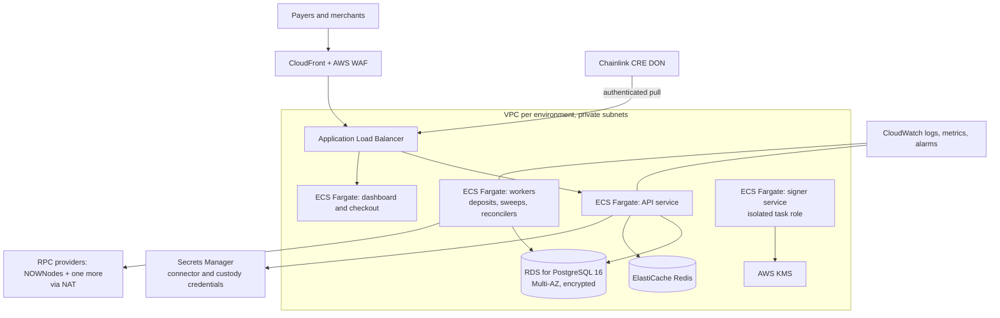
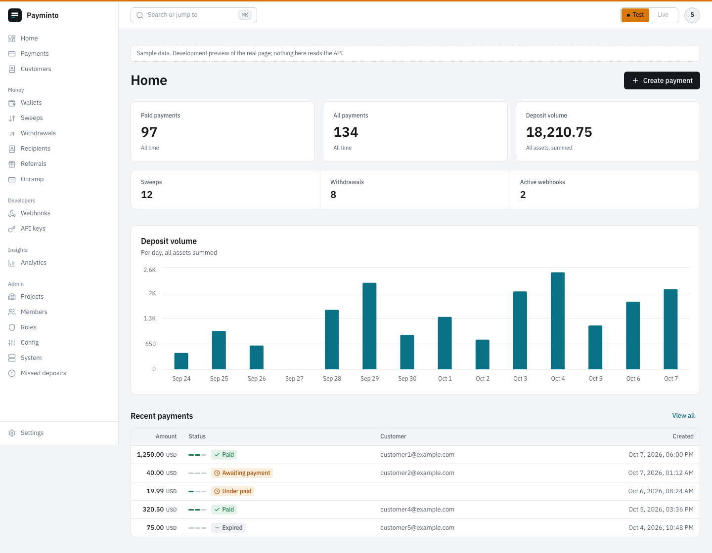

# AWS track: running the gateway on AWS

How the gateway is deployed on AWS: the services it uses, how keys and secrets are isolated, and how test and live stay separate.

**Status, stated plainly:** this is the deployment design. The application code it deploys is built and tested in this repository; the AWS infrastructure (Terraform or CDK) is not yet written and nothing is deployed to AWS today.

## Why AWS

- A self-hosted payment gateway is judged on how it keeps keys and money paths isolated. AWS KMS, Secrets Manager, IAM and separate accounts per environment give that isolation without custom key infrastructure.
- Agent payments are being built on AWS: x402 shipped in Amazon CloudFront, and AWS is a premier member of the x402 Foundation under the Linux Foundation with American Express, Cloudflare, Google, Mastercard, Shopify, Stripe and Visa ([Coinbase CDP](https://docs.cdp.coinbase.com/x402/support/x402-foundation)).
- The deployers we target (platforms and PSPs settling stablecoins B2B, a ~$226B a year flow per [a16z](https://a16zcrypto.com/posts/article/state-of-crypto-report-2025/)) already run on a hyperscaler and need a gateway that fits their cloud controls.

## Architecture



### Live and test isolation

```mermaid
flowchart LR
  subgraph TestAcct[AWS account: test]
    T1[Gateway stack<br/>GATEWAY_ENVIRONMENT=test] --> T2[(RDS: *_test database)]
  end
  subgraph LiveAcct[AWS account: live]
    L1[Gateway stack<br/>GATEWAY_ENVIRONMENT=live] --> L2[(RDS: live database)]
    L1 --> L3[KMS keys for signing]
  end
  CI[CI pipeline] -->|signed image| TestAcct
  CI -->|same signed image, promoted| LiveAcct
```



The application already enforces this at boot (`backend/internal/environment/`): a live process refuses a development keystore, mock providers, a test database, a testnet chain, a single RPC provider, or a database stamped for the other environment; login tokens are bound to their environment.

## Mapping the code to AWS services

| Gateway component | AWS service | Notes |
| --- | --- | --- |
| API (`backend/cmd/server`) | ECS Fargate behind ALB | Stateless; scales on CPU and request count |
| Workers (deposit watchers, sweep reconciler, switch reconciler, CRE poller) | ECS Fargate service | Safe with several replicas: every money transition is a compare-and-set in Postgres |
| Migrations (`backend/cmd/migrate`) | One-off ECS task in the deploy pipeline | Runs as the migration role; the app role gets SELECT/INSERT on ledger tables only |
| Ledger and all state | RDS for PostgreSQL 16, Multi-AZ | Ledger triggers forbid UPDATE, DELETE and TRUNCATE; separate owner role |
| Rate limits and caches | ElastiCache Redis | Public limiters fail closed with an in-process fallback |
| Connector and custody credentials (Kuberpays, Payvang, BitGo) | Secrets Manager | Per merchant and environment; never logged |
| Signing keys | KMS, isolated signer task | Today the signer runs in-process (a tracked V1 limit); the AWS design moves it into its own task with the only KMS grant |
| Dashboard and hosted checkout (Next.js) | ECS Fargate or Amplify Hosting, behind CloudFront | Checkout is mobile-first and static-heavy |
| Webhooks out | Workers with retries and HMAC signatures | Optional SQS for back-pressure |
| Observability | CloudWatch logs, metrics and alarms | Alarms on anomalies: drift between ledger and chain, stuck sweeps, unresolved custody claims |
| Edge protection | CloudFront, AWS WAF | Rate rules on public payment-link and callback routes |

## The code this deployment relies on

### Live refuses unsafe configuration at boot: `backend/internal/environment/service.go`

Every refusal is collected so an operator fixes them in one pass; on AWS these map to the live account's task definition and Secrets Manager entries:

```go
refuse("development keystore or local vault master key is configured (unset AES_KEY and DEV_KEYSTORE)")
refuse("secrets vault is in development mode")
refuse("SERVER must be staging or production so secure cookie, HSTS and secret-strength rules apply")
refuse("POSTGRES_SSL_MODE must be verify-full (got %q)", facts.DatabaseSSLMode)
refuse("BLOCKCHAIN_NETWORK_TYPE must be mainnet for live money (got %q)", facts.NetworkType)
refuse("JWT_SECRET is a development default or shorter than 32 bytes; sessions would be forgeable")
```

`POSTGRES_SSL_MODE=verify-full` is what RDS with the AWS certificate bundle provides; `JWT_SECRET` comes from Secrets Manager; the slot checks refuse mock providers, so a live task cannot start on the mock connector, custody or CRE provider.

### The ledger is append-only for the application role: `backend/internal/ledger/`

On RDS the migration task runs as the migrator, which hands the ledger tables to a `NOLOGIN` owner role; the ECS app role keeps SELECT and INSERT only, and the live boot check refuses an app role that could rewrite history. `docs/OPERATIONS.md` ("Ledger roles") has the statements for managed Postgres where the migrator is not superuser.

### Code map

| Path | What it gives the AWS deployment |
| --- | --- |
| `backend/internal/environment/` | One environment per process, boot refusals, database stamp, environment-bound JWTs |
| `backend/internal/ledger/` | Append-only double-entry ledger with database-enforced protections |
| `backend/cmd/migrate` | Migration task, `--ledger-app-role`, `adopt-live` and `adopt-test` |
| `backend/internal/database/` | Contiguous migration manifest, DSN verification against what Postgres reports |
| `docker/` and `docker-compose*.yml` | Container images that become the ECS task images |

## Screenshots

The dashboard that runs behind CloudFront, with the test and live switch in the header:



## Deploy steps (design)

1. Two AWS accounts (test, live) under AWS Organizations; one VPC each.
2. RDS PostgreSQL 16 with a database named `*_test` in test; run `cmd/migrate up` as the migration role, then narrow the app role (`--ledger-app-role`).
3. Secrets Manager entries for `JWT_SECRET`, connector credentials, `NOWNODES_API_KEY` and a second RPC provider.
4. ECS services: api, workers, dashboard, checkout; signer task with the only KMS permission.
5. CloudFront + WAF in front; health checks on `/api/v1/health`.
6. Optional: enable the Chainlink CRE module (`CRE_ENABLED=true`, `CRE_PROVIDER=chainlink`) and allow the CRE DON to reach the authenticated liabilities route.

## Next

- Infrastructure as code (Terraform or CDK) for the design above.
- Move signing into the isolated signer service backed by KMS.
- An x402 receiver at the edge for pay-per-request APIs.
