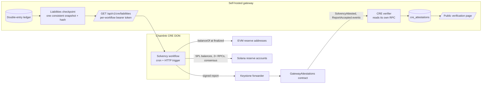
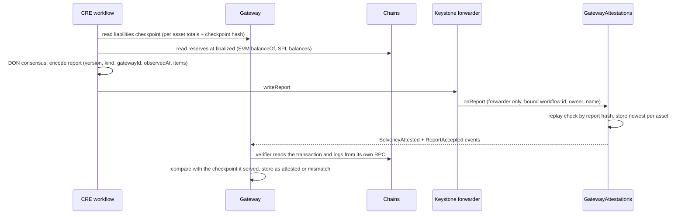
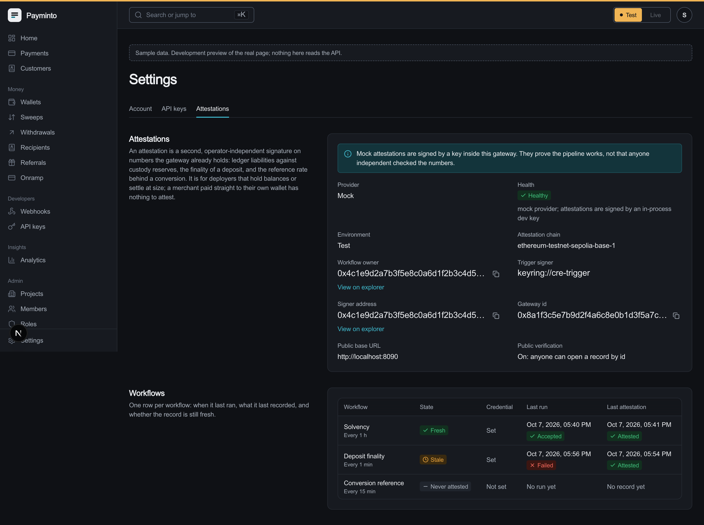
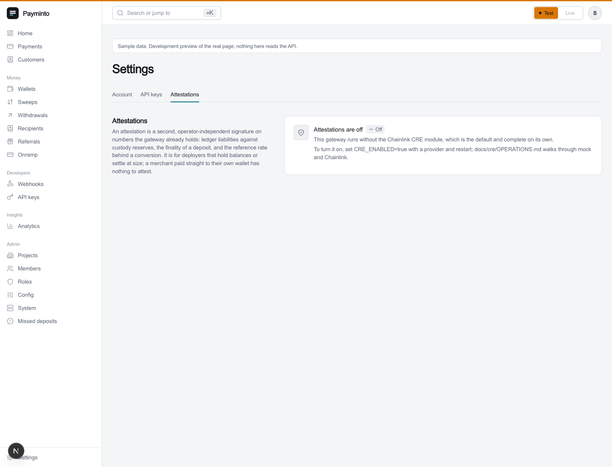

# Chainlink track: CRE solvency attestation for a self-hosted payment gateway

A Chainlink Runtime Environment (CRE) workflow that proves a payment gateway is solvent: it compares what the gateway's double-entry ledger owes merchants with what custody actually holds on chain, and writes a signed report on chain that anyone can verify.
Chainlink Proof of Reserve attests what an issuer holds; this also attests what the gateway owes.

## The problem

A merchant who lets a payment gateway hold funds has to trust its balance sheet.
Gateways fail exactly here: Triple-A lost $11.8M from its own treasury across seven chains in July 2026 ([TechNode Global](https://technode.global/2026/07/28/singapore-crypto-payments-firm-triple-a-says-own-digital-assets-hit-by-unauthorized-access/)).
Proof of Reserve verifies "what an issuer has, not what it owes" ([Spark research](https://www.spark.money/research/stablecoin-real-time-attestation-chainlink)).
A gateway can be fully reserved on chain and still owe merchants more than it holds; only a check of liabilities against reserves catches that.

## Market and why CRE

| Signal | Figure | Source |
| --- | --- | --- |
| Chainlink Proof of Reserve in production | 40+ feeds, 56 projects, $17B attested | [Spark](https://www.spark.money/research/stablecoin-real-time-attestation-chainlink), [Chainlink](https://blog.chain.link/largest-proof-of-reserve-provider/) |
| CRE in institutional finance | Swift with 17 banks preparing live transactions; DTCC Collateral AppChain in limited production; UBS fund workflows in pilot | [Chainlink](https://chain.link/press-releases/chainlink-is-enabling-financial-institutions-to-connect-to-swifts-blockchain-ledger), [Q2 2026 review](https://chain.link/blog/quarterly-review-q2-2026) |
| CRE availability | Live on 24 EVM mainnets, write-only on Solana (265-byte reports), deploy in Early Access | [CRE docs](https://docs.chain.link/cre/supported-networks-go) |
| Genuine stablecoin payments | ~$390B a year, $226B of it B2B | [a16z](https://a16zcrypto.com/posts/article/state-of-crypto-report-2025/) |

What institutions pay Chainlink for is continuous, machine-readable attestation that a contract or an auditor can act on.
A self-hosted gateway is exactly the party merchants cannot audit, so an independently signed solvency attestation is the trust feature a self-hoster can sell.

We ranked six CRE use cases by demand evidence (full research: `docs/cre/RESEARCH.md`):

1. **Solvency attestation** - built. Real buyers in the adjacent Proof of Reserve market, and it fills the liabilities gap.
2. **Deposit finality attestation** gating large settlements - next. Addresses the single-RPC trust gap behind gateway losses.
3. **Conversion reference rate** on executed trades - audit evidence only.
4. Cross-chain settlement via CCIP - cut; CCTP V2 already moves USDC to Solana.
5. x402 verification - cut; CRE's trigger quota cannot sit inside a 402 round trip.
6. ACE compliance - cut; private beta and EVM only.

## Architecture



### End to end



## What we built

| Piece | Path | State |
| --- | --- | --- |
| Consumer contract `GatewayAttestations` | `contracts/src/cre/` | Audited and re-audited; 81 Foundry tests including fuzz, invariants and delivery through Chainlink's real KeystoneForwarder |
| Workflow name binding | `contracts/src/cre/WorkflowName.sol` | Keystone HashTruncateName, pinned to the documented vector |
| Solvency workflow (TypeScript) | `cre/workflows/solvency/` | 25 tests; encoding matches the contract byte for byte; simulated and broadcast to a local chain |
| Gateway CRE module | `backend/internal/cre/` | Providers `none` (default), `mock`, `chainlink`; verifier reads its own RPC; lossless poller; consistent checkpoints |
| Install-time option | `CRE_ENABLED=false` by default; compose profile `cre` | With CRE off, routes and workers are identical (tested) |
| Dashboard settings | `frontend/app/dashboard/settings/attestations` | Shows on or off, provider, health, last attestation |

Contract rules: only the configured forwarder may call `onReport`; each report kind is bound to a workflow id, owner and name; a report is accepted once (seen-set on its hash) in any order; a solvency item is stored only if newer than the latest for its asset, otherwise it is recorded as ignored; no ETH or token custody; two-step ownership; no upgradeability.

## Screenshots

CRE settings in the merchant dashboard, with the module on and the latest attestation per workflow:


The same page in dark mode, and the off state a deployer sees when CRE is not enabled at install:




The attestation the gateway stored after verifying the on-chain report from its own RPC (real response from the local end-to-end run, `GET /api/v1/public/attestations/<id>`):

```json
{
  "kind": "solvency",
  "status": "attested",
  "provider": "chainlink",
  "independently_signed": true,
  "simulated": false,
  "chain": "ethereum-testnet-sepolia-base-1",
  "block_number": 1441,
  "consumer_address": "0xCf7Ed3AccA5a467e9e704C703E8D87F634fB0Fc9",
  "forwarder_address": "0x82300bd7c3958625581cc2F77bC6464dcEcDF3e5",
  "report_id": "0x0001",
  "subject_type": "ledger_checkpoint",
  "item": {
    "asset": "USDC",
    "decimals": 6,
    "liabilities_minor": "1250000000",
    "reserves_minor": "1300000000",
    "checkpoint_hash": "0xa3896d0d7e18dda7b3225fedc0d7b5833b661692c6d90cb1f98c493f7cf420b5"
  }
}
```

## The code

### Consumer contract: `contracts/src/cre/GatewayAttestations.sol`

Only the Keystone forwarder may call `onReport`; the report is bound to a workflow, checked for replay, then recorded:

```solidity
function onReport(bytes calldata metadata, bytes calldata report) external override onlyForwarder {
    Metadata memory m = _decodeMetadata(metadata);
    (uint8 kind, bytes32 gatewayId, uint64 observedAt, uint256 itemCount) = _decodeHeader(report);
    _requireBoundWorkflow(kind, m);
    bytes32 reportHash = keccak256(report);
    _admit(gatewayId, kind, observedAt, reportHash);

    if (kind == KIND_SOLVENCY) {
        _recordSolvency(report, gatewayId, observedAt);
    } else if (kind == KIND_DEPOSIT_FINALITY) {
        _recordDeposits(report, gatewayId, observedAt);
    } else {
        _recordConversions(report, gatewayId, observedAt);
    }
    ...
}
```

### Workflow name binding: `contracts/src/cre/WorkflowName.sol`

Keystone writes the workflow name into report metadata as the ASCII of the first 10 hex characters of `sha256(name)`. Binding it any other way makes every real report revert, which the audit caught:

```solidity
function keystone(string memory name) internal pure returns (bytes10 out) {
    bytes32 digest = sha256(bytes(name));
    bytes memory ascii = new bytes(10);
    for (uint256 i = 0; i < 5; ++i) {
        uint8 b = uint8(digest[i]);
        ascii[2 * i] = HEX[b >> 4];
        ascii[2 * i + 1] = HEX[b & 0x0f];
    }
    out = bytes10(ascii);
}
```

### Solvency workflow: `cre/workflows/solvency/main.ts`

Reads the liabilities checkpoint with identical-aggregation consensus, reads reserves at finalized blocks, and encodes exactly what the contract decodes:

```ts
export const encodeSolvencyReport = (report: SolvencyReport): Hex => {
  if (report.items.length === 0) throw new Error('solvency report carries no items')
  if (report.observedAt < 0n || report.observedAt > UINT64_MAX) throw new Error('observedAt is outside uint64')
  for (const item of report.items) {
    assertUint256(item.liabilities, `liabilities for ${item.asset}`)
    assertUint256(item.reserves, `reserves for ${item.asset}`)
  }
  return encodeAbiParameters(SOLVENCY_REPORT_PARAMS, [
    REPORT_VERSION, KIND_SOLVENCY, report.gatewayId, report.observedAt, report.items,
  ])
}
```

### Gateway verifier: `backend/internal/cre/verify.go`

Nothing from the request is trusted: workflow id, owner, name and gateway must match the configured bindings, and the chainlink provider re-reads the transaction from its own RPC:

```go
want, ok := v.Bindings[report.Kind]
if !ok || want.ID == ([32]byte{}) || meta.WorkflowID != want.ID {
    return nil, fmt.Errorf("%w: %x", ErrWrongWorkflow, meta.WorkflowID)
}
if meta.Owner != want.Owner {
    return nil, fmt.Errorf("%w: %s", ErrWrongOwner, common.BytesToAddress(meta.Owner[:]))
}
if meta.WorkflowName != want.Name {
    return nil, fmt.Errorf("%w: %x", ErrWrongName, meta.WorkflowName)
}
if report.GatewayID != v.GatewayID {
    return nil, fmt.Errorf("%w: %x", ErrWrongGateway, report.GatewayID)
}
```

### Code map

| Path | What |
| --- | --- |
| `contracts/src/cre/GatewayAttestations.sol`, `IReceiver.sol`, `WorkflowName.sol` | Consumer contract |
| `contracts/test/cre/` | Unit, fuzz, invariant, gas and real-forwarder tests |
| `contracts/script/DeployGatewayAttestations.s.sol` | Deploy script, dry run unless `--broadcast` |
| `cre/workflows/solvency/` | The workflow, its configs per target and tests |
| `cre/README.md` | Run with and without Chainlink access |
| `backend/internal/cre/` | Module: port, providers, verifier, poller, checkpoints, storage |
| `docs/cre/RESEARCH.md`, `SPEC.md`, `OPERATIONS.md` | Research, spec, operations |

## Proven end to end (local chain)

The workflow ran against a local Anvil chain with the Keystone mock forwarder:

- Simulation printed liabilities 1,250 USDC against reserves 1,300 USDC.
- Broadcast: the forwarder delivered the report, the contract emitted `SolvencyAttested` and `ReportAccepted`.
- The gateway verified the transaction from its own RPC and stored the attestation as `attested` with provider `chainlink`, served at `/api/v1/public/attestations/<id>`.

Reproduce: `cre/README.md` ("Without Chainlink access") and `DEMO.md`.

```bash
cd cre
~/.cre/bin/cre workflow simulate workflows/solvency --target local-simulation --non-interactive --trigger-index 0
```

## Trust model

- CRE attests the comparison; the gateway still decides nothing on CRE's word alone. Every report is re-verified from the gateway's own RPC against the on-chain event before it is shown.
- Reserve addresses come from workflow configuration, never from the gateway, so a compromised gateway cannot point the workflow at someone else's wallet.
- A figure that does not match what the gateway served is stored as `mismatch` with an anomaly, never shown as attested.
- Simulated reports are labelled, never shown as production, and refused in live.
- With CRE off, the gateway behaves exactly as without the module.

## Going to production

Needs Chainlink Early Access: `cre login`, Vault DON secrets, `cre workflow deploy`, and binding the real workflow id and owner in `setWorkflow` and the gateway's environment. The order is in `cre/README.md`.

## Next

- Deposit finality attestation gating settlements above a merchant-set threshold (ticket 24), the settlement gate (21b).
- Attestation badges on settlements and a public verification page in the dashboard (ticket 26).
- A Solana receiver program for 265-byte reports (ticket 28).
