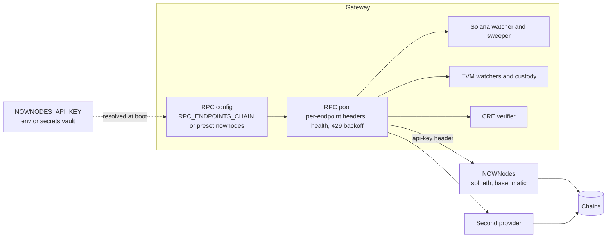
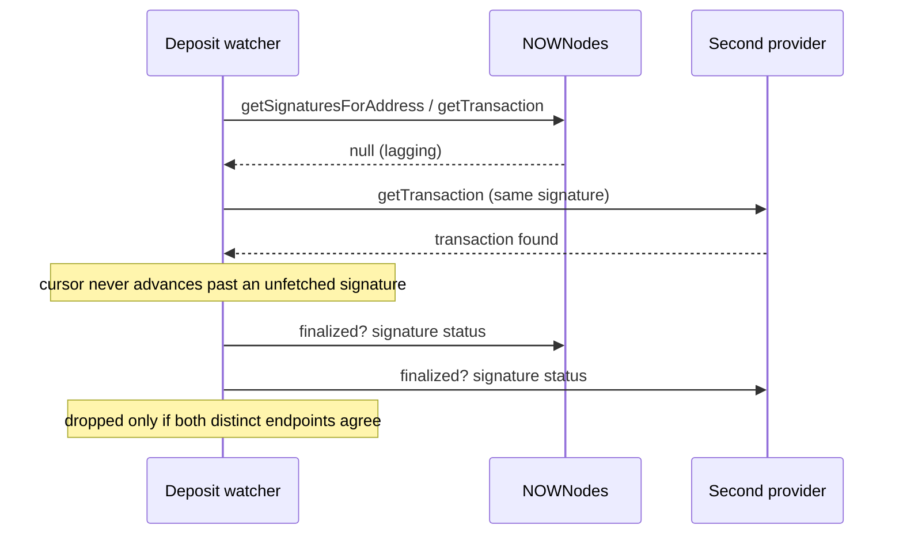

# NOWNodes track: RPC for Solana and the EVM chains

The gateway reads every chain it accepts payments on: it watches deposits, proves finality, sweeps funds and, with Chainlink CRE, checks reserves.
All of that depends on RPC.
NOWNodes is our RPC provider for Solana and the EVM chains.

## Why RPC is a money-safety problem, not a plumbing detail

- A lagging node returns nothing for a transaction it just listed; a gateway that trusts one node skips that deposit for ever.
- A node that briefly loses a transaction makes a live deposit look dropped; a gateway that trusts one node refunds or re-requests money it already has.
- Gateway losses cluster here: Triple-A lost $11.8M across seven chains in July 2026 ([TechNode Global](https://technode.global/2026/07/28/singapore-crypto-payments-firm-triple-a-says-own-digital-assets-hit-by-unauthorized-access/)), and Chainlink hackathon gateway BLINK documented RPC flakiness as its main operational pain.

So the gateway treats RPC as evidence, and a single source of evidence is not enough for money:

- **Live requires at least two distinct RPC providers** per chain (enforced at boot, see `backend/internal/modules/solana.go`).
- **A deposit is dropped only when two distinct endpoints agree** after finalization.
- **A custody payout is declared not-sent only when two nodes, each at a pinned finalized block, agree** that the nonce was used by another transaction and our hash is absent.

NOWNodes is one of those providers; any second provider pairs with it.

## Verified endpoints

Checked with the project key on 2026-10-07 using read-only calls (`getSlot`, `eth_chainId`):

| Chain | Network | Endpoint | Answer |
| --- | --- | --- | --- |
| Solana | mainnet | `https://sol.nownodes.io` | current slot |
| Solana | testnet | `https://sol-testnet.nownodes.io` | current slot |
| Ethereum | mainnet | `https://eth.nownodes.io` | chain id 1 |
| Ethereum | Sepolia | `https://eth-sepolia.nownodes.io` | chain id 11155111 |
| Base | mainnet | `https://base.nownodes.io` | chain id 8453 |
| Base | Sepolia | `https://base-sepolia.nownodes.io` | chain id 84532 |
| Polygon | mainnet | `https://matic.nownodes.io` | chain id 137 |

The key goes in the `api-key` header.
NOWNodes serves Solana testnet, not devnet, so the test environment uses Solana testnet mints when NOWNodes is the provider.

## Architecture





## The code

On branch `nownodes` (stopped for the submission deadline, not yet merged into `main`); tests pass on that branch.

### Presets: `backend/internal/blockchain/rpcspec/presets.go`

```go
// NOWNodes endpoints verified in ticket 29 (.scratch/payments-v1/issues/29-nownodes-rpc.md).
// No Polygon testnet and no Solana devnet: NOWNodes serves neither, so those combinations refuse.
var NOWNodes = Preset{
    Name:       "nownodes",
    Domain:     "nownodes.io",
    HeaderName: "api-key",
    KeyEnv:     "NOWNODES_API_KEY",
    Hosts: map[string]map[Network]string{
        "ETH":     {Mainnet: "eth", Testnet: "eth-sepolia"},
        "BASE":    {Mainnet: "base", Testnet: "base-sepolia"},
        "POLYGON": {Mainnet: "matic"},
        "SOL":     {Mainnet: "sol", Testnet: "sol-testnet"},
    },
}
```

The header value is a reference (`env:NOWNODES_API_KEY`) resolved at boot, so the key never appears in configuration files, and header values are redacted from every log and error.

### Code map

| Path | What | Where |
| --- | --- | --- |
| `backend/internal/blockchain/rpcspec/` | Endpoint spec with per-endpoint headers, value references, NOWNodes preset | branch `nownodes` |
| `backend/internal/blockchain/rpc_pool.go` and the EVM, Tron and Bitcoin clients | Send the configured headers on every call | branch `nownodes` |
| `backend/internal/modules/solana.go` | Live refuses fewer than two distinct Solana endpoints | `main` |
| `backend/internal/service/solana_*` | Drop and finality evidence from distinct endpoints | `main` |

## Next

- Merge the `nownodes` branch and wire the Solana adapter to the preset.
- NOWNodes gRPC ([docs](https://docs.nownodes.io/grpc-api/)) for Solana: stream account updates instead of polling, with JSON-RPC as the fallback.
- A smoke test (`-tags=nownodes`) that runs only when `NOWNODES_API_KEY` is set.
