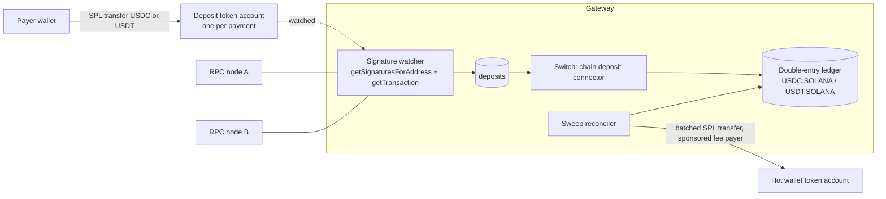
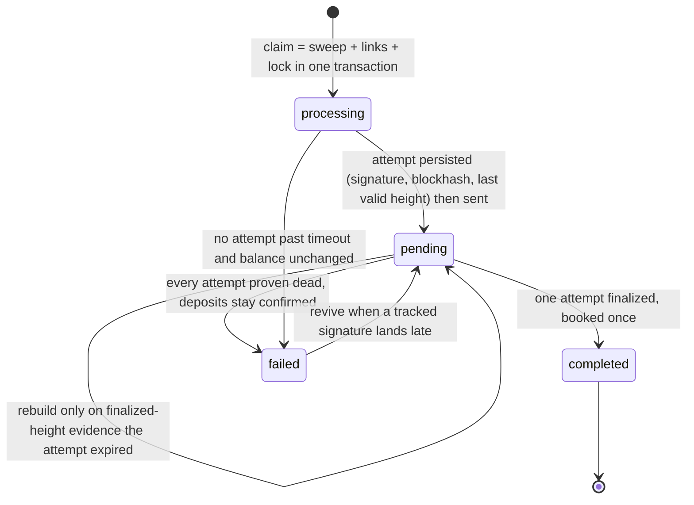
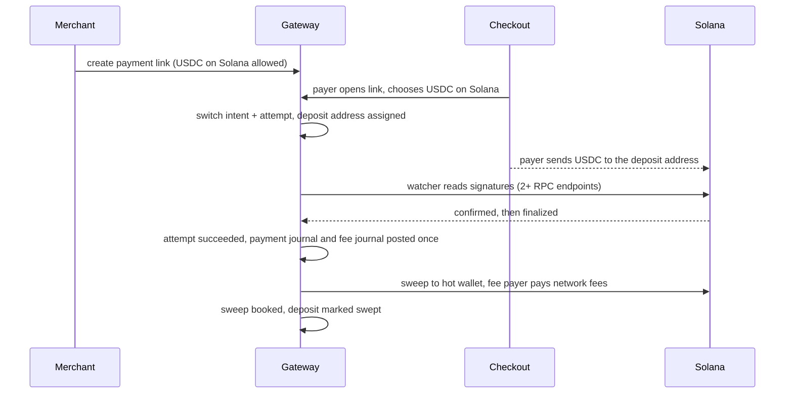

# Solana track: stablecoin acceptance and settlement on Solana

An open-source, self-hostable payment gateway that accepts USDC and USDT on Solana side by side with cards and UPI, books every movement in one double-entry ledger, and sweeps funds safely under a state model that survives crashes, lagging RPC nodes and racing workers.

## Why Solana

The money in stablecoins today is business-to-business settlement, and that settlement is moving to Solana.

- Visa launched USDC settlement for US issuers and acquirers over Solana on 2025-12-16, at $3.5B annualised rising to $7B by April 2026 ([Visa](https://investor.visa.com/news/news-details/2025/Visa-Launches-Stablecoin-Settlement-in-the-United-States-Marking-a-Breakthrough-for-Stablecoin-Integration/default.aspx)).
- Mastercard named Solana among its eight settlement networks, and Stripe's native USDC acceptance settles there ([TheStreet](https://www.thestreet.com/crypto/markets/mastercard-taps-solana-as-it-brings-stablecoin-settlement)).
- Solana carried 32.6% of weekly adjusted stablecoin transfer volume in April 2026, ahead of Ethereum, Tron and Base ([bex.co](https://bex.co/blog/2026/04/03/solana-650b-stablecoin-volume-record-svm-settlement-layer)).
- Solana carries 76% of x402 agent-payment traffic ([SolanaCompass](https://solanacompass.com/news/solana-processes-76-of-all-x402-ai-agent-transactions-232-million-in-four-weeks)).

## Market size

| Measure | Figure | Source |
| --- | --- | --- |
| Genuine stablecoin payments, 12 months to Sept 2025 | ~$390B | [a16z State of Crypto 2025](https://a16zcrypto.com/posts/article/state-of-crypto-report-2025/), [McKinsey/Artemis via KuCoin](https://www.kucoin.com/news/flash/mckinsey-and-artemis-report-only-1-of-stablecoin-35t-volume-is-real-payments) |
| of which B2B | $226B, +733% year on year | same |
| Stripe's 2025 stablecoin payment volume | ~$400B, about 60% B2B | [CoinDesk](https://www.coindesk.com/business/2026/02/24/stripe-s-bridge-sees-stablecoin-volume-quadruple-as-utility-insulates-from-crypto-winter) |
| Retail-sized merchant stablecoin payments, 2025 | ~$70B, +83% year on year | [Flagship Advisory](https://flagshipadvisorypartners.com/insights/6-and-counting-the-state-of-stablecoin-merchant-acceptance/) |
| Stablecoin PSP take rate | 0.8% to 1.5% | same |
| Recent acquisitions | Stripe bought Bridge for $1.1B; Mastercard agreed to buy BVNK for up to $1.8B; MoonPay bought Solana payments firm Helio for $175M | [WhiteSight](https://whitesight.net/stripes-1-1-billion-bridge-to-programmable-money/), [The Block](https://www.theblock.co/post/393898/mastercard-to-acquire-stablecoin-infrastructure-firm-bvnk-for-up-to-1-8-billion), [The Block](https://www.theblock.co/post/334269/moonpay-acquires-premiere-solana-payment-firm-helio-in-175-million-deal) |

The gap we fill: no open-source, self-hostable codebase joins card and UPI acceptance with stablecoin settlement.
The open-source orchestrator at scale, Hyperswitch (45.3k stars), has two crypto connectors, and one of them (Coinbase Commerce) shut on 2026-03-31 ([Hyperswitch docs](https://docs.hyperswitch.io/integrations/connectors-integrations/payment-processor-capabilities/payment-methods-setup/crypto)).

## What we built



- **USDC and USDT as peer assets.** Each is its own ledger asset (`USDC.SOLANA`, `USDT.SOLANA`) with its mint as seed data per environment; Token-2022 mints are rejected by default.
- **Addresses.** One deposit owner per payment, derived with SLIP-0010 ed25519 at `m/44'/501'/n'/0'`; the deposit address is the owner's associated token account, and payments sent to the owner address are detected too.
- **Detection.** Signatures are polled per watched account with persisted cursors and parsed from `jsonParsed` transactions. `confirmed` means seen, `finalized` means credited. The credit is the observed balance change of the deposit account, never the instruction amount.
- **Safety against bad nodes.** A null transaction from a lagging node never advances the cursor. A deposit is dropped only when two distinct endpoints agree after finalization. A dropped deposit later seen finalized is credited once.
- **Wrong token never credited.** A transfer of the wrong mint, native SOL, or a Token-2022 mint is recorded as an anomaly.
- **Sweeps.** Batched SPL transfers to the hot wallet, a separate fee payer, emptied accounts closed to reclaim rent, network fees booked in `SOL.SOLANA`.
- **One payment journal per deposit.** Payments created through the switch are booked by the switch; legacy payments are booked by the watcher; never both.

### The sweep state model

The sweep path is written so that any crash, slow signer or second worker can be recovered from the database and the chain alone. Full rules: `backend/internal/service/SOLANA_SWEEPS.md`.



- Every signature is persisted before it is sent, so a send error never loses one.
- One sweep in flight per token account, enforced by a unique lock row.
- Every transition is a compare-and-set on the status and version it was decided from, so a stale worker changes nothing.
- Deposits become `swept` only when a finalized attempt is booked.

### How a Solana payment flows end to end



## Where the code is

| Path | What |
| --- | --- |
| `backend/internal/blockchain/solana/` | Keys, SLIP-0010 derivation, PDA and ATA derivation, SPL and compute-budget instructions, JSON-RPC client, deposit parser, sweep builder |
| `backend/internal/service/solana_*` | Signature watcher, deposit service, sweep service and reconciler |
| `backend/internal/service/SOLANA_SWEEPS.md` | The sweep state model and invariants |
| `backend/internal/modules/solana.go` | Wiring: chain row, RPC pool policy, environment policy, mint validation at boot |
| `backend/internal/database/migrations/2026100712_solana_deposit_accounts.up.sql` | Deposit accounts, sweep attempts, locks |

## How it was tested

- Unit tests with recorded RPC fixtures for USDC and USDT, wrong mint, owner-address payments, confirmed then finalized, drops, partial and over payment, sweep construction and ledger postings.
- Reviewer probes for every crash and race found in review, kept as regression tests.
- An end-to-end test on `solana-test-validator`: create two mints, pay to the token account, to the owner, with the wrong mint and in two parts, finalize, sweep both mints and close the accounts.

```bash
cd backend
go test ./internal/blockchain/solana/... ./internal/service/...
go test -tags=integration ./internal/service/ -run TestSolanaEndToEnd   # needs solana-test-validator
```

## RPC providers

Live refuses to start with fewer than two distinct RPC endpoints, because a single node cannot prove a deposit was dropped.
NOWNodes Solana endpoints are verified for use (`sol.nownodes.io` mainnet, `sol-testnet.nownodes.io` testnet, key in the `api-key` header); wiring them as a preset is the next step (ticket 29).

## What is next

- Custody providers for Solana: self-custody payouts and BitGo (`tsol`/`sol`) wallets and payouts, chosen per merchant (ticket 12).
- Conversion at receipt through Jupiter, with the executed rate booked as a ledger trade (ticket 10).
- NOWNodes gRPC streaming for faster deposit detection, with JSON-RPC as the fallback.
- An x402 receiver on Solana for pay-per-request APIs.
