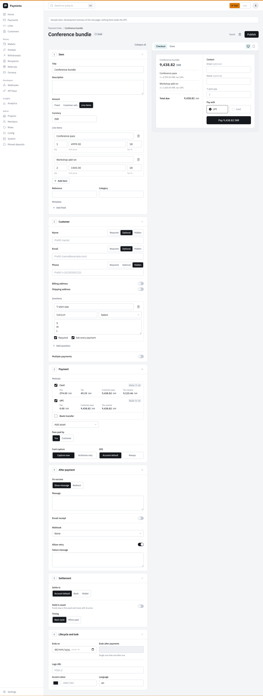
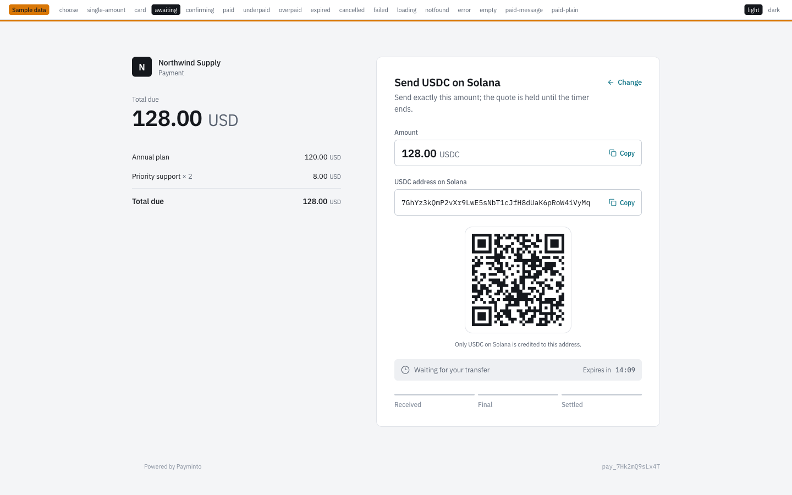
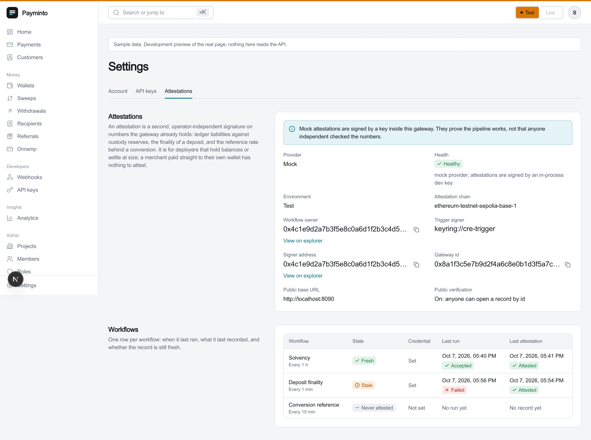

# Payminto on the web

| What | Link |
| --- | --- |
| Website | [payminto.io](https://payminto.io) |
| App (merchant dashboard) | [app.payminto.io](https://app.payminto.io) |
| Source code | [github.com/payminto-io/app](https://github.com/payminto-io/app) |

## What you will find

- **payminto.io** - the product: an open-source, self-hostable payment gateway that connects multiple payment providers and stablecoins as peer rails on one double-entry ledger, with an optional Chainlink CRE workflow that proves the gateway is solvent.
- **app.payminto.io** - the merchant dashboard: payments, payment links with a live checkout preview, wallets, settlements and the CRE attestation settings.
- **This repository** - everything needed to self-host it; start with the [README](README.md), the [hackathon tracks](tracks/README.md) and the [demo script](DEMO.md).

## Demo

| What | Link |
| --- | --- |
| Demo walkthrough (click path, what is real, how to re-run) | [DEMO.md](DEMO.md) |
| Chainlink CRE solvency attestation | [tracks/chainlink/README.md](tracks/chainlink/README.md) |
| Solana USDC and USDT | [tracks/solana/README.md](tracks/solana/README.md) |
| NOWNodes RPC | [tracks/nownodes/README.md](tracks/nownodes/README.md) |
| AWS deployment design | [tracks/aws/README.md](tracks/aws/README.md) |

### Screens

| Dashboard | Payment link builder |
| --- | --- |
|  |  |

| Hosted checkout, USDC on Solana | Chainlink CRE attestation settings |
| --- | --- |
|  |  |

### The live Chainlink proof

The CRE solvency workflow compared what the ledger owes merchants (1,250 USDC) with what custody holds on chain (1,300 USDC), delivered a signed report through the Chainlink Keystone forwarder to our `GatewayAttestations` contract, and the gateway verified it from its own RPC and stored it as attested.
How to reproduce it: [cre/README.md](cre/README.md).
